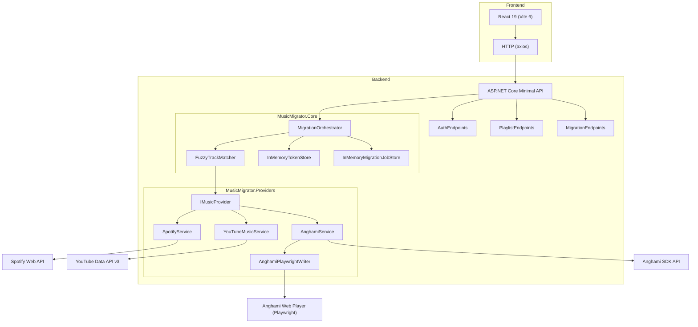

# MusicMigrator

Cross-platform playlist migration between Spotify, YouTube Music, and Anghami.


## What It Does

MusicMigrator lets you move playlists and music libraries between Spotify, YouTube Music, and Anghami without manual track-by-track searching. You authenticate with at least two platforms via OAuth, pick a source playlist and a destination platform, and the system automatically matches every track using ISRC codes and fuzzy title+artist comparison. The web UI shows live per-track progress so you can watch the migration happen in real time.

## Architecture Overview



## Tech Stack

| Technology | Version | Purpose |
|---|---|---|
| .NET | 10 | Backend runtime |
| ASP.NET Core Minimal API | 10 | Backend framework |
| C# | 13 | Backend language |
| React | 19 | Frontend framework |
| Vite | 6 | Frontend build tool |
| react-router-dom | 7 | Frontend routing |
| axios | latest | Frontend HTTP client |
| SpotifyAPI.Web NuGet | latest | Spotify SDK |
| Google.Apis.YouTube.v3 NuGet | latest | YouTube SDK |
| Microsoft.Playwright NuGet | latest | Browser automation (Anghami writes) |
| Anghami Integration | Playwright (Chromium) | Full web automation for login, read, and write |

## Prerequisites

- [.NET 10 SDK](https://dotnet.microsoft.com/download/dotnet/10.0)
- [Node.js v24 LTS](https://nodejs.org/)
- Git

Playwright installs its own Chromium browser automatically during setup — no separate browser installation required.

## Project Structure

```
/ (repository root)
├── .gitignore                          # Git ignore rules for .NET, Node, OS, and Playwright
├── backend/
│   ├── MusicMigrator.sln               # .NET solution file
│   ├── MusicMigrator.Core/             # Domain models, interfaces, orchestration logic
│   ├── MusicMigrator.Providers/        # Spotify, YouTube, and Anghami implementations
│   └── MusicMigrator.API/              # Minimal API host: endpoints, DI, middleware
└── frontend/
    ├── package.json                    # Node dependencies and scripts
    ├── vite.config.js                  # Vite dev server config with API proxy
    ├── index.html                      # HTML shell
    └── src/
        ├── main.jsx                    # React entry point
        ├── App.jsx                     # Router setup (/, /select, /progress/:jobId)
        ├── services/                   # API client (axios)
        ├── pages/                      # ConnectAccounts, SelectPlaylists, MigrationProgress
        └── components/                 # ProviderCard, TrackStatusRow
```

## Platform Credentials Setup

### Spotify

1. Go to [Spotify Developer Dashboard](https://developer.spotify.com/dashboard).
2. Create a new app (any name).
3. Under **Edit Settings**, add this redirect URI:
   ```
   http://localhost:5000/auth/spotify/callback
   ```
4. Copy the **Client ID**.

Fill in `backend/MusicMigrator.API/appsettings.json`:

```json
"Spotify": {
  "ClientId": "YOUR_SPOTIFY_CLIENT_ID",
  "RedirectUri": "http://localhost:5000/auth/spotify/callback"
}
```

No client secret is needed — MusicMigrator uses Spotify's PKCE flow for public clients.

### YouTube Music

1. Go to [Google Cloud Console](https://console.cloud.google.com).
2. Create a project or select an existing one.
3. Enable the **YouTube Data API v3**.
4. Under **Credentials**, create **OAuth 2.0 Client ID** (Web application type).
5. Add this authorized redirect URI:
   ```
   http://localhost:5000/auth/youtube/callback
   ```
6. Copy the **Client ID** and **Client Secret**.

Fill in `backend/MusicMigrator.API/appsettings.json`:

```json
"YouTube": {
  "ClientId": "YOUR_GOOGLE_CLIENT_ID",
  "ClientSecret": "YOUR_GOOGLE_CLIENT_SECRET",
  "RedirectUri": "http://localhost:5000/auth/youtube/callback"
}
```

### Anghami

Anghami uses credential-based login via Playwright. No API key or client ID is required. Enter your Anghami email and password directly in the Connect Accounts screen. The Developer Portal is not yet publicly open — the SDK-based OAuth implementation is preserved in the codebase and will be activated when API access becomes available.

## Running the Project

### 1. Install Playwright browser (first time only)

Run this from the `backend/` directory:

```powershell
dotnet run --project MusicMigrator.API -- playwright install chromium
```

### 2. Start the backend

```powershell
cd backend
dotnet run --project MusicMigrator.API
```

The API starts at **http://localhost:5000** with Swagger available at **http://localhost:5000/swagger**.

### 3. Start the frontend

```powershell
cd frontend
npm run dev
```

The frontend runs at **http://localhost:5173** and proxies API calls to the backend automatically.

## How Migration Works

**User flow:**

1. **Connect accounts** — Authenticate with at least two platforms via OAuth PKCE. Each provider card shows connection status. Spotify and YouTube use OAuth 2.0 + PKCE. Anghami uses direct credential login via an inline form.
2. **Select playlist** — Pick a source platform, a destination platform, and the playlist to migrate.
3. **Watch progress** — The progress page polls the backend every 2 seconds, showing a progress bar, match statistics, and a live table of per-track results.

**Track matching:**

When a track is migrated, the system first attempts an **ISRC code lookup** (the most reliable cross-platform identifier). If an exact ISRC match is found on the destination platform, confidence is set to **1.00** and the track is matched immediately. If ISRC is unavailable (YouTube and Anghami do not expose ISRCs), the system falls back to **normalized title + artist fuzzy matching**. Normalization strips feat./ft./with clauses, removes non-word characters, and collapses whitespace. Tracks scoring below **0.50** confidence are skipped.

## API Reference

### Auth

| Method | Endpoint | Description |
|---|---|---|
| GET | `/auth/status` | Returns connection status for all three providers |
| GET | `/auth/spotify/start` | Redirects to Spotify OAuth authorization page |
| GET | `/auth/spotify/callback` | Handles Spotify OAuth callback, stores token |
| GET | `/auth/youtube/start` | Redirects to Google OAuth authorization page |
| GET | `/auth/youtube/callback` | Handles YouTube OAuth callback, stores token |
| GET | `/auth/anghami/start` | Redirects to Anghami OAuth authorization page |
| GET | `/auth/anghami/callback` | Handles Anghami OAuth callback, stores token |
| DELETE | `/auth/{provider}` | Disconnects a provider by removing its stored token |

### Playlists

| Method | Endpoint | Description |
|---|---|---|
| GET | `/playlists/{provider}` | Returns all playlists for the authenticated user on a given provider |

### Migration

| Method | Endpoint | Description |
|---|---|---|
| POST | `/migrate` | Starts a new migration job (returns 202 Accepted with job ID) |
| GET | `/migrate/{jobId}` | Returns full job state including per-track results |
| GET | `/migrate` | Lists all migration jobs for the current session |

## Known Constraints

- **Anghami uses Playwright for all operations (login, read, write)** because the official SDK is not yet publicly accessible. The SDK-based implementation is preserved in AnghamiApiClient.cs, AnghamiAuthHandler.cs, and AnghamiService.cs and will replace the Playwright approach when Anghami grants API access.
- **YouTube tracks have no ISRC.** The YouTube Data API v3 does not expose ISRC codes or album metadata. Track matching for YouTube-sourced tracks relies entirely on title + artist fuzzy matching, which may be less accurate for covers or remixes.
- **No token refresh automation.** OAuth token refresh logic is implemented in all three auth handlers but is not automatically triggered on 401 responses. A manual reconnect is required if a token expires mid-session. This will be addressed in a future phase.
- **In-memory state.** All data (tokens, migration jobs) is stored in memory. A server restart clears everything. No database is used in Phase 1.

## Roadmap

- Token auto-refresh — automatically refresh expired OAuth tokens on 401 responses
- Persistent storage — migrate from in-memory stores to Redis or SQL for production durability
- Anghami official write API — replace Playwright automation with native API calls when Anghami releases their write endpoint
- Production deployment guide — containerization, reverse proxy configuration, and environment variable management
